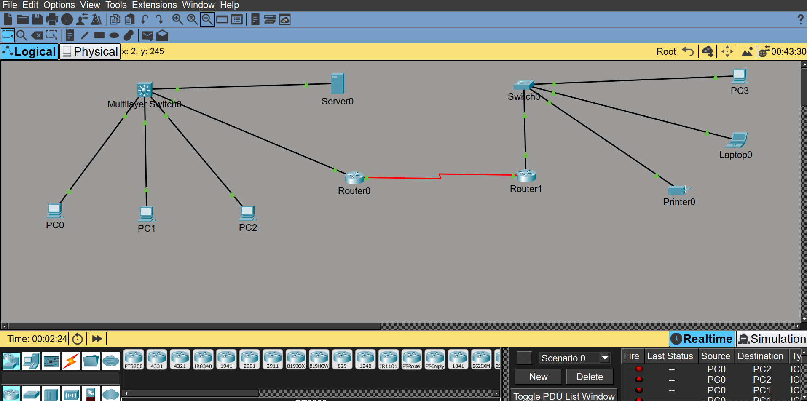

# Enterprise Multi-Site Network Infrastructure & Routing Architecture

## 📌 Project Overview
This project models a scalable, secure, and fully redundant enterprise network architecture connecting a Head Office (HQ) campus to a remote Branch Office (BO). The design implements robust segmented local area networks (LANs), dynamic wide area network (WAN) routing, and centralized network services. 

The ultimate goal of this project was to establish seamless, end-to-end connectivity across a simulated serial WAN link while ensuring strict logical traffic separation using IEEE 802.1Q VLAN encapsulation.

---

## 🛠️ Key Architectural Features
* **Layer 3 Core Switching:** Multi-Layer Switching (MLS) handling high-speed Inter-VLAN routing at the campus core.
* **Router-on-a-Stick (RoaS):** Sub-interface routing configuration on the Branch edge to maximize hardware utilization.
* **Dynamic WAN Routing:** OSPF (Open Shortest Path First) Area 0 for automated, fault-tolerant path determination.
* **Centralized DHCP Relay:** Implementing `ip helper-address` across a WAN link to dynamically provision branch endpoints from a single server farm.

---

## 🏢 Network Architecture Breakdown

### 1. Head Office (HQ) Core & Services
* **Core Switch (`HQ-Core-SW01` / Cisco 3560 MLS):** Coordinates all internal campus traffic and handles Inter-VLAN routing. 
    * Connected to the Edge Router via a dedicated routed port (`no switchport`) on interface `Gig0/1`.
* **Logical Segmentation:**
    * `VLAN 10`: Sales
    * `VLAN 20`: IT Department
    * `VLAN 99`: Management Network
* **Central Server Farm (`Server0`):** * **IP Address:** `192.168.99.50` (Static)
    * **Roles:** Central Web/DNS Server and master DHCP Server hosting individual scope pools for both `Branch-Sales` and `Branch-IT`.

### 2. WAN Link & Dynamic Routing
* **WAN Topography:** A simulated point-to-point Serial leased line (`10.0.0.0/30`) interconnects the HQ Edge Router (`Router0`) and the Branch Edge Router (`Router1`).
* **Routing Protocol:** **OSPF Process 1 (Area 0)** is enabled across all layer 3 nodes (`HQ-Core-SW01`, `Router0`, and `Router1`), dynamically advertising internal subnets and ensuring sub-second convergence.

### 3. Branch Office (BO) Design
* **Edge Router (`BO-Router01` / Router1):** Configured with 802.1Q trunk encapsulation on physical interface `Gig0/0`.
    * `Gig0/0.11 (Branch Sales)`: Gateway `192.168.11.1/24` with an active DHCP relay pointing to `192.168.99.50`.
    * `Gig0/0.21 (Branch IT)`: Gateway `192.168.21.1/24` with an active DHCP relay pointing to `192.168.99.50`.
* **Layer 2 Access Switch (`BO-Switch01` / Switch0):**
    * Uplink port `Gig0/1` configured as a 802.1Q Trunk port directly to the router.
    * VLAN database updated to handle `VLAN 11` and `VLAN 21` traffic.

---

## 💻 Endpoint Management & Status

| Device | Location | VLAN | Port Assignment | IP Addressing Type | Assigned IP Address | Status |
| :--- | :--- | :--- | :--- | :--- | :--- | :--- |
| **PC3** | Branch | VLAN 11 (Sales) | `Fa0/1` | Dynamic (DHCP) | `192.168.11.10` | 🟢 Online |
| **Laptop0** | Branch | VLAN 11 (Sales) | `Fa0/2` | Dynamic (DHCP) | `192.168.11.11` | 🟢 Online |
| **Printer0** | Branch | VLAN 21 (IT) | `Fa0/3` | Static | `192.168.21.5` | 🟢 Online |
| **Server0** | Head Office | VLAN 99 (Mgmt) | Core Link | Static | `192.168.99.50` | 🟢 Online |

> 💡 *Note: The legacy VoIP architecture was deliberately omitted during this deployment cycle to optimize data-plane traffic and maintain a lean, high-throughput topology.*

---

## 🚀 Verification & Testing
To confirm the integrity of the OSPF routing tables and the DHCP relay behavior, rigorous end-to-end testing was conducted.

* **DHCP Verification:** Branch endpoints successfully crossed the WAN serial link via `ip helper` to pull correct leases from the HQ server pool.
* **ICMP Reachability:** Complete end-to-end connectivity verified with a **100% success rate (0% packet loss)**. Branch clients can seamlessly ping the central HQ Server (`192.168.99.50`).

```bash
# Example ICMP verification from Branch PC3 to HQ Server0
Packet Tracer PC CLI: ping 192.168.99.50

Pinging 192.168.99.50 with 32 bytes of data:
Reply from 192.168.99.50: bytes=32 time=12ms TTL=125
Reply from 192.168.99.50: bytes=32 time=10ms TTL=125
Reply from 192.168.99.50: bytes=32 time=11ms TTL=125
Reply from 192.168.99.50: bytes=32 time=10ms TTL=125

Ping statistics for 192.168.99.50:
    Packets: Sent = 4, Received = 4, Lost = 0 (0% loss),
Approximate round trip times in milli-seconds:
    Minimum = 10ms, Maximum = 12ms, Average = 10ms
